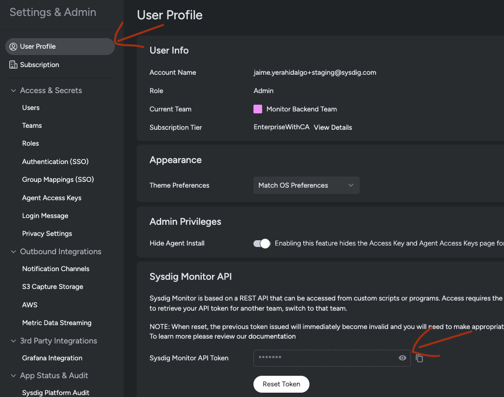
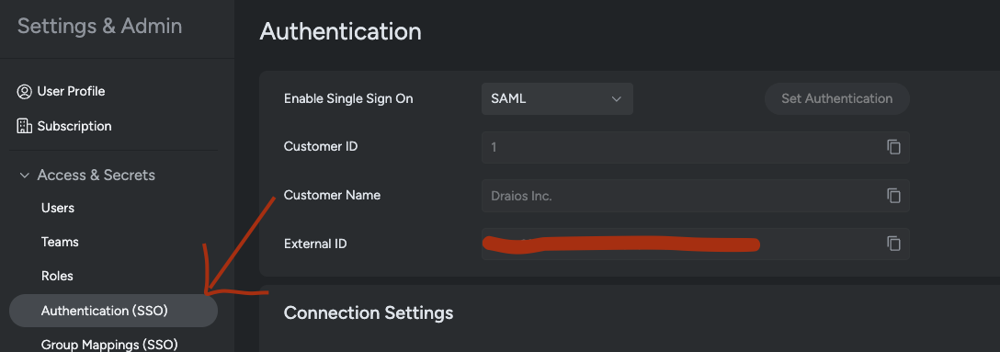
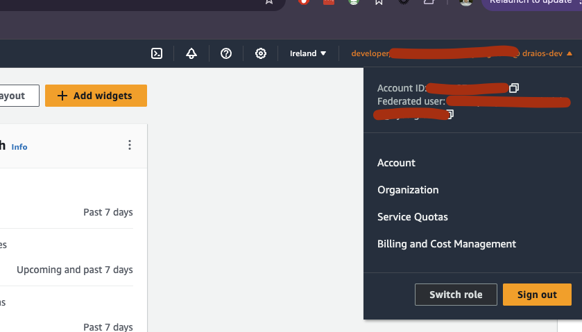

# terraform-aws-monitor-for-cloud
Monitor repo for Terraform AWS modules in sysdiglabs

## How to run the module

### Configure the parameters in the module

Select your **api_key** and **sysdig_external_id** from your Sysdig monitor profile:





And select your **sysdig_aws_account_id** from you aws profile:



```
module "sysdig_cloudwatch_metrics_stream" {
    source = "./cloud-watch-metrics-stream"
    
    api_key = "xxxxxxxx-xxxx-xxxx-xxxx-xxxxxxxxxxxx"
    sysdig_site = "https://app-staging.sysdigcloud.com"
    sysdig_aws_account_id = "xxxx-xxxx-xxxx" # this is draios-dev
    monitoring_role_name = "TestTerraformSysdigCloudwatchIntegrationMonitoringRole"
    create_new_role = true
    sysdig_external_id = "xxxxxxxx-xxxx-xxxx-xxxx-xxxxxxxxxxxx"
}
```

### Config the terraform provider:

```
terraform {
  required_version = ">= 1.0.0"
  required_providers {
    aws = {
      version = ">= 5.0.0"
    }
  }
}

provider "aws" {
  region                      = "eu-west-1"
}
```

### Execute terraform module

Go to `/modules`directory and run the following commands:

 - `terraform init` : Initialyze terraform directory using the provider config, this following command will create the file `.terraform.lock.hcl` and you will be able to create the resources.
 - `terraform plan` : Show every single resource that is going to be created/changed/deleted
 - `terraform apply`: it will ask if you approves the creation (write yes because I supose you are following these steps for that reason :D)


